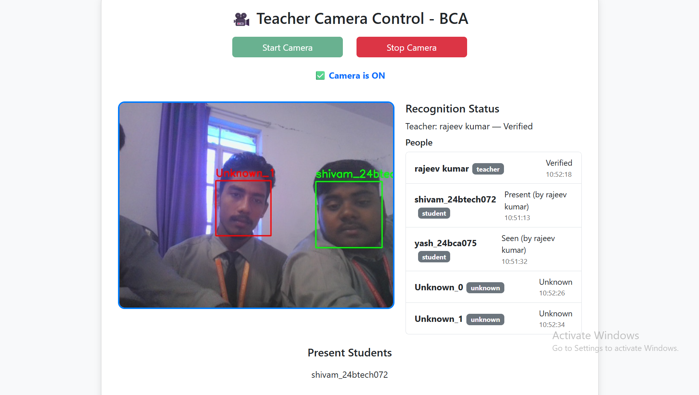
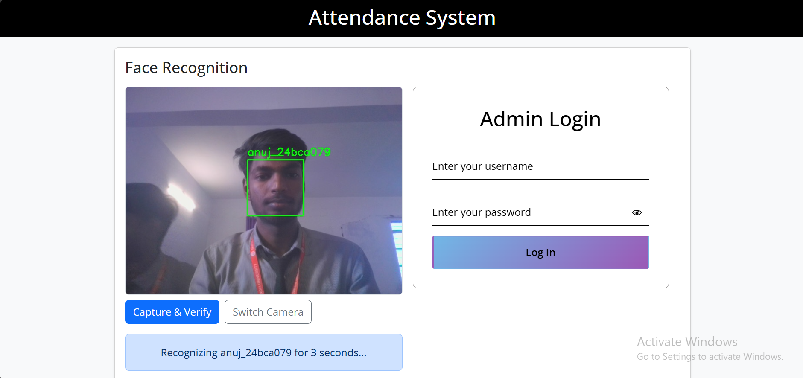
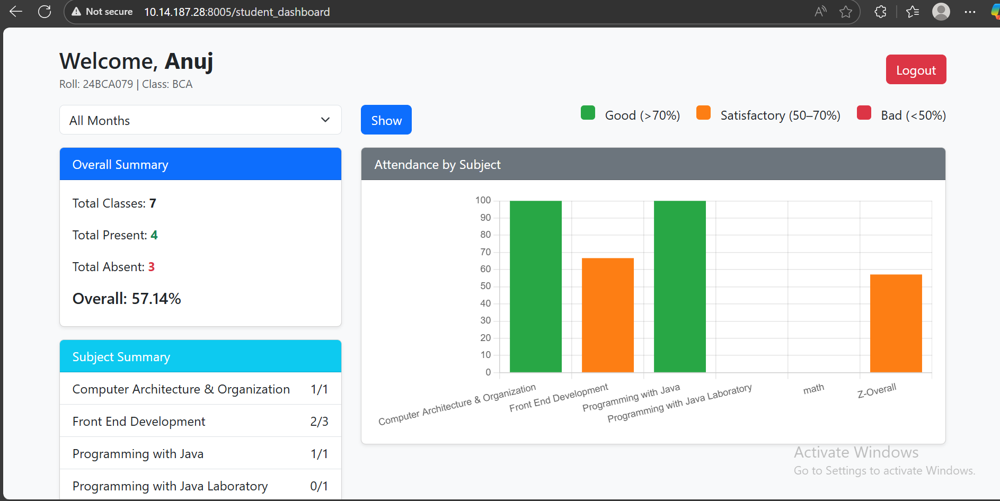
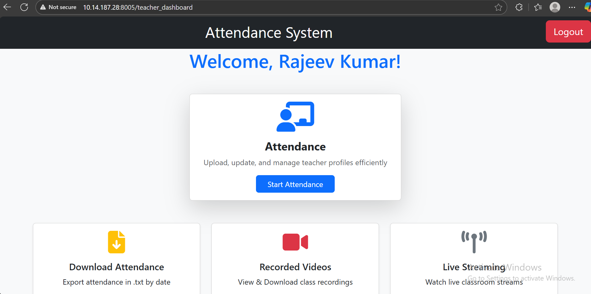
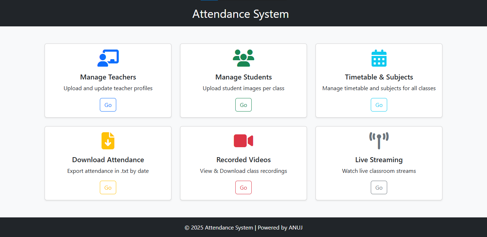

# 🎓 Multi-Class Face Recognition Attendance System

> An AI-powered automatic attendance system that uses **real-time face recognition**, **teacher verification**, and **timetable-based automation** to mark attendance and record class sessions.

---

# Camera Behavior in Attendance System

## Web Camera (Desktop)
When the attendance system uses a web camera, the class automatically starts according to the timetable, and the web camera is also activated automatically.  
- **Teacher seen time:** 30 seconds  
- **Student seen time:** 10 minutes  

## Mobile Camera
When the attendance system uses a mobile camera, the class starts based on the timetable, but the teacher has the option to manually start or stop the camera at any time during the class period.  
- **Teacher and student seen time:** 2 seconds  
- **Eye blink detection** is required for liveness verification



---

# LOGIN SYSTEM

## 1. Admin Authentication Algorithm
**Purpose:** Verify admin login.  
**Steps:**
1. Admin visits `/` (login page).  
2. User submits username and password.  
3. Check if username exists in `USERS` dictionary.  
4. Compare submitted password with stored password.  
5. If match:  
   - Create a User object (`UserMixin`).  
   - Log in user using `login_user`.  
   - Redirect to `/admin_dashboard` (main page).  
6. If no match:  
   - Show error message (**Invalid credentials**).  

**Logout Algorithm:**  
1. Access `/logout`.  
2. Call `logout_user()` to clear session.  
3. Redirect to login page.  

---

## 2. Teacher & Student Verification Algorithm
**Purpose:** Verify identity via webcam/IP camera using face recognition and a blink for liveness.  

**Steps:**
1. Start camera using OpenCV (`cv2.VideoCapture(ip_camera)`).  
2. Load face encodings:  
   - `teacher_encodings` and `teacher_names`  
   - `student_encodings` and `student_names`  

3. For each frame from camera:  
   - Convert frame to RGB.  
   - Detect faces using `face_recognition.face_locations`.  
   - Encode detected faces using `face_recognition.face_encodings`.  
   - Detect facial landmarks (eyes, nose, mouth, etc.).  

4. For each face:  
   - Compare face encoding with all stored encodings (`compare_faces` + `face_distance`).  
   - If match found:  
     - Determine role: **teacher/student**.  
     - If a teacher then it stores their name and login with that teacher name.  
     - If a student then it stores student’s name, roll no, class and login with that to show their attendance.  

5. **Blink detection:**  
   - Calculate Eye Aspect Ratio (EAR) for left & right eye.  
   - If EAR < 0.21 → eye closed.  
   - Record blink for that face.  

6. **Continuous recognition:**  
   - Track how long the face is visible (`start_time[name]`).  
   - If visible ≥ 3–5 seconds and blink was detected for the same face:  
     - Verification successful.  
     - Store info in `recognized_user`.  
     - Stop camera.  
   - Else:  
     - Verification fails; reject login.  

7. Draw rectangle & label on the video frame.  

8. Stream frames to browser (`multipart/x-mixed-replace`).  

**Key Notes:**
- Blink ensures liveness, preventing photos or videos from spoofing login.  
- 3–5 second continuous recognition ensures stability (face is consistently identified).  

**What to do for login**
- Stand in front of the camera.  
- Blink once to verify liveness.  
- Wait 3 seconds for continuous recognition.  
- Redirect:  
  - **Teacher → Teacher Dashboard**  
  - **Student → Student Dashboard**  

**Check Attendance**
- Students can view monthly/subject-wise attendance.  
- Teachers can take/view attendance.  



---

# STUDENT DASHBOARD

## 1. Attendance Retrieval Algorithm
**Purpose:** Fetch student attendance records.  

**Steps:**
1. Student logs in and is recognized.  
2. Identify roll number and class name from `recognized_user`.  
3. Open `static/attendance/<class_name>` folder.  
4. Iterate over date folders (format `dd-mm-YYYY`).  
5. For each date:  
   - Read subject files (`.txt` or `.csv`).  
   - Check if student roll is present → mark **Present** or **Absent**.  
6. Update totals:  
   - `Total_present`  
   - `Total_absent`  
   - `total_classes`  
7. Update monthly summary:  
   - `Month key → total present, total classes`  
8. Update subject summary:  
   - `Subject → total present, total classes`  
9. Return JSON for frontend/student_dashboard:  
   - **Bar graph of attendance**  
   - **Overall attendance percentage**  
   - **Date-wise and subject-wise records**  
   - `records`: daily attendance per subject  
   - `month_summary`: present/total per month  
   - `subject_summary`: present/total per subject  
10. Optional: Filter by a specific month.  

11. Logout button to return to the login page..  



---

## TEACHER DASHBOARD

Accessible after **TEACHER login** 
* After login, it shows the teacher’s name 

- **Start Attendance**
   - Start or stop the camera depending on the class to take attendance

- 📥 **Attendance Reports**
  - View or Download `attendance.txt` files based on class, date, and subject

- 📹 **Recorded Sessions**
  - View or download class recordings by class and date

- 📺 **Live Streaming**
  - Watch real-time video stream of any classroom in session

- Logout button to return to the login page..  




---

## ADMIN DASHBOARD

Accessible after **Admin login**:

- 👨‍🏫 **Manage Teachers**
  - Upload, view, and delete teacher profiles

- 👨‍🎓 **Manage Students**
  - Upload, edit, and delete student images by class

- 🗓️ **Timetable & Subject Setup**
  - Add or edit class-wise timetable
  - Map subjects to teachers for each class

- 📥 **Attendance Reports**
  - View or Download `attendance.txt` files based on class, date, and subject

- 📹 **Recorded Sessions**
  - View or download class recordings by class and date

- 📺 **Live Streaming**
  - Watch real-time video stream of any classroom in session

- Logout button to return to the login page..  



---

## ⚙️ System Overview

This system integrates **Computer Vision**, **AI-based Face Recognition**, and **Time-based Decision Logic** to automate attendance taking in classrooms.

🧩 1. Overview

The file app.py runs a Flask web app that:

* Detects teachers and students in real time.
* Automatically starts attendance when the teacher appears.
* Marks students as Present if they stay visible long enough.
* Saves attendance records and recorded videos for each class.
* Streams live video from a class camera.
* Provides APIs to show real-time recognition status on a dashboard.

---
## 1️⃣ PREPROCESSING ALGORITHMS

### A. Face Encoding Loader

**Algorithm:** Facial Feature Extraction

1. Load each face image using `face_recognition.load_image_file()`.
2. Detect faces → Extract 128D embeddings using:
   ```python
   enc = face_recognition.face_encodings(img)
   ```
3. Store embeddings with names in a `.pkl` file.
4. During runtime, these are loaded for matching.

---

### B. Timetable Matching

**Algorithm:** Time-based Schedule Matching

**Goal:** Detect which subject is currently ongoing.

**steps:**

1. Load timetable JSON for a class (e.g., `bca_timetable.json`).
2. Get current system time.
3. For today’s weekday (e.g., Monday), loop through time slots:
   ```python
   for start, end, subject in timetable["Monday"]:
    if start <= now < end:
        return (start, end, subject)
   ```
→ Identifies which subject is currently ongoing.

**Used for:**
Knowing which subject's teacher to verify.

---

### C. Teacher-Subject Mapping

**Algorithm:** Key-Value Matching

1. Load teacher-subject JSON.
2. Find teacher by matching `subject.lower() == current_subject.lower()`.
3. Used to verify correct teacher before attendance begins.

---

## 2️⃣ FACE DETECTION & RECOGNITION ALGORITHMS

### A. Face Detection

**Algorithm:** HOG or CNN-based localization (via `face_recognition`)

1. Each video frame → RGB.
2. Call:
   ```python
   face_locations = face_recognition.face_locations(frame)
   ```
3. Returns bounding boxes (top, right, bottom, left) of each detected face.

---

### B. Face Recognition

**Algorithm:** KNN-like nearest distance classification

1. Compute encoding for each detected face.
   ```python
   enc = face_recognition.face_encodings(frame, [location])
   ```
2. Compare to all known encodings (teacher + student):
   ```python
   matches = face_recognition.compare_faces(all_encs, enc)
   distances = face_recognition.face_distance(all_encs, enc)
   ```
3. If any match is True, find the minimum distance:
   ```python
   best = np.argmin(distances)
   ```
4. If that match’s distance < threshold → mark recognized name.
Otherwise, label as `"Unknown_<id>"`.

In short:
* Recognition = nearest-neighbor classification using face embeddings.

---

### C. Visual Annotation Algorithm

For each detected face:
   1. Draw bounding box (cv2.rectangle).
   2. Display name (cv2.putText).
   3. Color-code roles:

Role-based Color Coding

* **Teacher (verified) →** White  
* **Teacher (seen) →** Blue  
* **Student (present) →** Green  
* **Unknown →** Red

Used in live stream display identify statuses for clarity.

---

## 3️⃣ ATTENDANCE DECISION SYSTEM (STATE MACHINE)

This is the logical heart of the application — determining when to start attendance, who gets marked, and when to save.

### A. Teacher Detection Logic

**Goal:** Start attendance only when the correct teacher is verified.

Algorithm Steps:→
1. When teacher recognized:
   * If name == correct_teacher → start timer.
2. If the same teacher remains visible for ≥ `TEACHER_DETECTION_THRESHOLD` seconds:
   * Mark verified → start attendance.
3. Log:  
   `"👨‍🏫 Teacher verified — attendance started."`

This ensures no false trigger — teacher must stay visible for a few seconds.

---

### B. Student Detection Logic

**Goal:** Students are marked Present only if seen continuously for a set time.

Algorithm Steps:
1. When a student is recognized:
   * If attendance has started:
      * If name not in `student_presence:
student_presence[name] = datetime.now() → start timer`
      * If student seen first time → record `first_seen`.
      * If seen again and `(now - first_seen) >= STUDENT_PRESENCE_THRESHOLD`:
     → Mark `"Present"`.
2. Update recognition status:
   ```python
   _update_recognition_status(name, "student", "Present", verified_by=teacher)
   ```

Students must be consistently visible for a given threshold time to be considered present.

---

### C. Unknown Handling

* Faces not matching encodings → `"Unknown_<id>"`
* Logged but ignored for attendance.


---

### D. Recognition Status Tracking

**Shared State Dictionary:**
```python
recognition_status[name] = {
  "role": "student"/"teacher"/"unknown",
  "status": "Seen"/"Present"/"Verified",
  "last_seen": timestamp,
  "verified_by": teacher_name
}
```

* Protected by `status_lock` for thread safety.
* Enables live dashboard visualization on the web interface.
```python
with status_lock:
    recognition_status[name] = {...}
```
---

### E. Attendance Saving Algorithm

At end of class:

1. Create directory:  
   `/static/attendance/<class>/<date>/`
2. Save summary file:
   ```
   Class: AI
   Time: 09:00 - 10:00

   Present Students:
   - Anuj
   - Rahul
   ```
→ Ensures persistent daily attendance record.

---

## 4️⃣ MAIN CONTROL LOOP
The continuous logic running inside main():
```python
while True:
    current_class = get_current_class(CLASS_NAME)
    if current_class:
        correct_teacher = get_correct_teacher(subject_mapping, subject)
        wait until teacher verified
        start_recording(subject)
        while class ongoing:
            capture frame
            detect_faces_and_mark(frame)
            write_frame_to_video(frame)
        stop_recording()
        save_attendance()
        reset_state()
    else:
        sleep(1)
```

**Core Logic:**  
This is a continuous event-driven loop:
* It Synchronizes **class time**, **teacher verification**, **student detection**, and **attendance logging** in real time or automatically.

---

## 5️⃣ FLASK WEB SERVICE ALGORITHMS

| Route | Functionality |
| ------ | -------------- |
| `/start_camera` | Start camera capture for class |
| `/stop_camera` | Stop capture + save recording |
| `/video_feed` | Stream live camera feed |
| `/recognition_status` | Return all detected names + statuses |
| `/get_attendance` | Return final attendance list |

All routes access shared variables safely with thread locks.

---

## 6️⃣ STATE MANAGEMENT

**Concurrency Pattern:** Monitor Pattern (Thread Locks)

Locks used:
* `frame_lock`
* `capture_lock`
* `status_lock`

Prevents data conflicts between:
* Flask thread (UI/API)
* Main recognition loop (processing)

---

## 7️⃣ TIME DEPENDENCY LOGIC

**A. Temporal Validation**
```python
(datetime.now() - first_seen).seconds >= THRESHOLD
```
→ Ensures stability (no false triggers).

**B. Schedule Sync**
```python
if start <= now < end:
    run_attendance()
```
→ Active only during valid class hours.

---

## ✅ 8️⃣ COMPLETE PIPELINE SUMMARY

```
Start Flask + Main Thread
│
├──> Load encodings, timetable, subjects
│
├──> Infinite Loop:
│     ├─ Check current class from timetable
│     ├─ Find assigned teacher
│     ├─ Wait until teacher is recognized for ≥ threshold
│     │     └─ attendance_started = True
│     ├─ Start recording video
│     ├─ While within schedule:
│     │     ├─ Capture frame
│     │     ├─ Detect + recognize faces
│     │     ├─ Update recognition_status
│     │     ├─ Mark students “Present” after threshold time
│     │     └─ Write frame to video + stream to Flask
│     ├─ Stop recording when class ends
│     ├─ Save attendance text file
│     └─ Reset all states
│
└──> Repeat for next class

```

---

## ALGORITHMIC CHARACTERISTICS

| Category | Description |
| -------- | ------------ |
| **Type** | Event-driven, state-based automation |
| **Core AI** | Face recognition (embedding-based) |
| **Temporal Logic** | Threshold-based validation |
| **Concurrency Model** | Multi-threaded (Flask + main loop) |
| **Output** | Attendance text file + video recording |
| **Error Handling** | Locks, checks, retries |

---

## 💬 System Intuition

> The system acts like a **digital classroom observer**:
>
> * Watches the class via camera  
> * Waits for assigned teacher verification  
> * Tracks students continuously  
> * Marks attendance automatically  
> * Records video for audit and resets for next class  

---

# Future Enhancements

1. **Server for Global Use**  
   Implement a centralized server to enable access and usage of the attendance system globally.

2. **Database Connectivity**  
   Integrate a database (MongoDB) to store and manage attendance, user details, and class records efficiently.

3. **Mobile Responsive Design**  
   Make the web interface fully responsive to ensure smooth usage across all screen sizes and mobile devices.

4. **Student Attendance Notifications**  
   Add a notification feature to inform students about their daily attendance summary.

5. **Dual Camera Support**  
   Enable the system to use dual cameras simultaneously for better accuracy and coverage during attendance.

---

## 🧾 Author

**Developed by:** *Anuj Kumar*  

**Project:** *Multi-Class Face Recognition Attendance System*  
**Tech Stack:** Python, Flask, OpenCV, face_recognition

**Email:** akash7anuj@gmail.com

---
