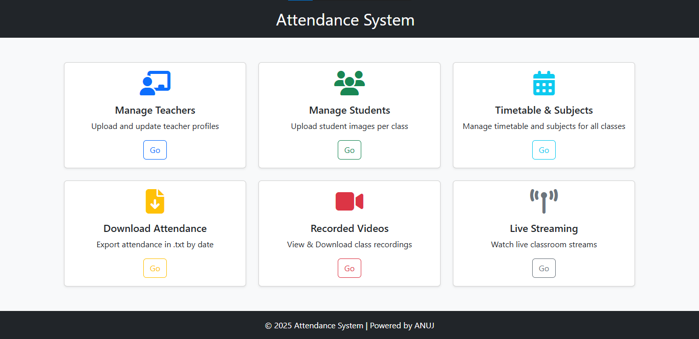

# 📚 Attendance System — Face Recognition Based

An AI-powered smart attendance system that uses face recognition to automate student attendance, verify teachers, record classes, and stream the live session via a Flask web app.

---

## ✅ How It Works

- 🔹 Load **teacher faces** (for all known teachers).
- 🔹 Load **student faces** based on selected class.
- 🔹 Load **timetable** for the selected class.
- 🔹 Load **teacher's subject mapping** for the class.
- 🔹 Automatically **start or stop camera** based on current timetable slot.
- 🧠 Real-Time Face Detection Logic
  - 🟥 **Unknown person** → Red box
  - 🟦 **Any other teacher** → Blue box
  - ⚪ **Current teacher** → White box
  - 🟩 **Student** → Green box (Marked present if seen for defined threshold)
- 🔹 Detect **current subject's assigned teacher**:
  - If verified teacher is present for a short threshold time, **attendance starts**.
- 🔹 If student seen for given threshold, it make that student present
- 📄 Saves `attendance.txt` for each subject per class, date, and time
- ⏺️ Records video of the full session (browser-compatible `.mp4`)

---

## 🌐 Web Dashboard Features

Accessible after **Admin or Teacher login**:

- 👨‍🏫 **Manage Teachers**
  - Upload, view, and delete teacher profiles

- 👨‍🎓 **Manage Students**
  - Upload, edit, and delete student images by class

- 🗓️ **Timetable & Subject Setup**
  - Add or edit class-wise timetable
  - Map subjects to teachers for each class

- 📥 **Attendance Reports**
  - Download `attendance.txt` files based on class, date, and subject

- 📹 **Recorded Sessions**
  - View or download class recordings by class and date

- 📺 **Live Streaming**
  - Watch real-time video stream of any classroom in session

---

## ✅ Features

### 🧑‍🏫 Teacher Verification
- Detects and verifies the **correct assigned teacher** using face recognition.
- Starts attendance automatically **after a defined time threshold** once the correct teacher is present.

### 🎓 Student Attendance Tracking
- Detects student faces using `face_recognition`.
- Marks students **"Present"** only if they stay continuously visible for a set duration.
- Ignores unknown or unauthorized individuals.

### 📆 Timetable-Based Automation
- Automatically matches **current time and day** with the class timetable.
- Fetches the ongoing class's subject, start time, and end time.
- **Automatically starts and stops attendance** and recording *based on schedule*.

### 📹 Video Recording
- Starts webcam and records the entire session using **OpenCV + FFmpeg**.
- Saves recordings as `.mp4` files in a folder structure:
  ```
  VIDEO_DIR/class_name/DD-MM-YYYY/subject_timestamp.mp4
  ```
- Uses H.264 encoding and browser-compatible settings (`yuv420p`, `+faststart`).

### 📝 Attendance Saving
- Creates subject-wise attendance `.txt` files under:
  ```
  ATTENDANCE_DIR/class_name/DD-MM-YYYY/subject.txt
  ```
- Saves:
  - Class subject
  - Start and end time
  - List of present students

### 🌐 Live Video Streaming (Web App)
- Streams live annotated webcam feed via browser using Flask.

### 🧠 Face Recognition System
- Loads **student and teacher face encodings** from pre-trained data.
- Handles multiple known individuals.
- Displays bounding boxes and names with color coding:
  - ⚪ Verified teacher of current subject
  - 🟩 Present student
  - 🟥 Unknown
  - 🟦 Other teacher

### 🗂️ Directory Management
- Auto-creates folders for attendance, videos, and others files.
- Keeps the project organized by **class name, date, and subject**.

### 🔒 Login Page (HTML/CSS/JS)
- ✅ Login system for Teachers/Admins
- use **Flask-Login for authentication**.

### ♻️ Reusable Modular Code
- All major logic (attendance, face detection, timetable, video) is split into **modular `core/` scripts**.
- Code is clean, maintainable, and ready for scaling.

---

## 💻 WebApp Dashboard
  - ✅ Flask-based Attendance System web app

| Section               | Description                                             |
|-----------------------|---------------------------------------------------------|
| **Manage Teachers**   | Upload/update teacher profiles with face encodings.     |
| **Manage Students**   | Upload student images class-wise for face recognition.  |
| **Upload Timetable**  | Upload timetable for each class (in JSON format).       |
| **Download Attendance** | Download `.txt` reports for class attendance.         |
| **Recorded Videos**   | View/download previously recorded class videos.         |
| **Live Streaming**    | Watch real-time classroom streams from browser.         |



---

## ⚙️ Technologies Used
- Python
- Flask
- OpenCV
- face_recognition (dlib)
- FFmpeg
- HTML/CSS/JS & bootstrap (Login & UI)

---

## 🗂️ Folder Structure

```
ATTENDANCE_SYSTEM/
│
├── core/                     # Core functional scripts
│   ├── attendance_saver.py
│   ├── face_detector.py
│   ├── face_encoder.py
│   ├── main.py
│   ├── teacher_subject_loader.py
│   ├── timetable_loader.py
│   └── video_recorder.py
│
├── encodings_faces/         # Pre-computed face encodings
│   ├── student_bca_encodings.pkl
│   ├── student_mca_encodings.pkl
│   └── teacher_encodings.pkl
│
├── static/                  # Static assets and outputs
│   ├── attendance/          # Saved attendance TXT files
│   ├── recorded_videos/     # Saved session videos
│   ├── student_images/      # Uploaded student photos
│   ├── teacher_images/      # Uploaded teacher photos
│   ├── teacher_subjects/    # Mapping of teachers to subjects
│   └── timetables/          # Class-wise timetables
│
├── templates/               # HTML (if Flask or Jinja used)
│
├── app.py                   # Main application (raw)
├── config.py                # Configuration variables
├── mp4_for_browser.py       # Video processing
├── encoding_faces.py        # Utility to encode face datasets
├── mongodb.py               # MongoDB integration script
├── requirements.txt         # Required Python libraries
├── run_bca.py               # Run for BCA attendance and live streaming
├── run_btech.py             # Run for B.Tech attendance and live streaming
├── run_mca.py               # Run for MCA attendance and live streaming
├── server.py                # Server or backend logic
├── run_server.py            # run the server 
├── next_step.txt            # Notes/plans for future
```

---

## 🚀 How to Run

### ✅ Requirements

- Python 3.8+
- Required packages:
  ```bash
  pip install -r requirements.txt
  ```

### 🧪 Initial Setup

1. Create necessary folders:
   ```
   static/attendance/
   static/recorded_videos/
   static/student_images/
   static/teacher_images/
   static/timetables/
   static/teacher_subjects/
   encodings_faces/
   ```

2. upload timetable json file for each classes:
    ```
   - static\timetables\bca_timetable.json
   - static\timetables\mca_timetable.json
    ```

3. upload teacher's subject json file for each classes:
```
   - static\teacher_subjects\bca_subjects.json
   ```


4. Upload images:
```
   - Place student and teacher images in respective folders.
   - Ensure student images are meaningful (e.g., `24BCA101_Rahul.jpg`)
   - Ensure teacher's image with theirs names
   ```

5. Generate Encodings:
   ```bash
   python encoding_faces.py
   ```

6. Run the server:
   ```bash
   python run_server.py
   ```
7. run the class:
   ```bash
   python run_bca.py
   python run_mca.py
   python run_btech.py
   ```
---

8. Optional: modify config.py:
```
   - change folder locations 
   - update threshold time in seconds for teacher or student detection
   - change login user & password
   - change camera for each class
   - change live streaming IP address or URL
   ```


## 📥 Output Examples

- **Attendance txt:**
  ```
  /static/attendance\bca\15-06-2025\Computer Architecture & Organization.txt
  Class: Computer Architecture & Organization
  Time: 18:18-18:19
  Present:
  Anuj
  ```

- **Saved Video File:**
  ```
  /static\recorded_videos\bca\15-06-2025/
    Computer Architecture & Organization_20250615_180842.mp4
  ```

- **live streaming of classes**

---

## 📈 Future Improvements
- ✅ Add support for dual camera setup
- 🔄 Merge multiple run scripts into one with dynamic class selection
- 📧 Send email/SMS alerts to absentees
- 🧠 Use MongoDB for central attendance storage and querying


---

## 👨‍💻 Author

**Anuj Kumar Singh**  
📧 Powered by ❤️ | [2025 Attendance System]  
